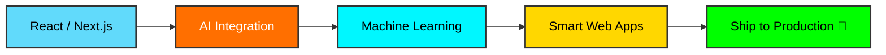

<div align="center">

<!-- Animated Header -->


<!-- Typing SVG -->
<a href="https://git.io/typing-svg">
  
</a>

<br/>

<!-- Profile Views -->


</div>

---

<div align="center">

## 💫 About Me

</div>

```javascript
const mairaj = {
    name: "Muhammad Mairaj Shaikh",
    role: "Frontend + AI/ML Developer",
    location: "🌍 Building the Future with Code",
    focus: ["Frontend Development", "AI/ML Integration", "Intelligent Web Apps"],
    currentlyLearning: ["Next.js", "Machine Learning", "AI APIs", "Deep Learning"],
    collaborationInterests: ["Open Source", "AI-Powered Web Apps", "React Projects"],
    techPassion: "Merging beautiful UI with the power of AI 🚀",
    mantra: "⚡ Build. Break. Learn. Repeat.",
    contact: "MuhammadMairajShaikh46@gmail.com"
};
```

<div align="center">

### 🎯 What Drives Me

</div>

<table align="center">
<tr>
<td align="center" width="33%">

<br><b>Frontend Mastery</b>
<br>Crafting stunning UIs with React & Next.js
</td>
<td align="center" width="33%">

<br><b>AI/ML Integration</b>
<br>Embedding intelligence into every app
</td>
<td align="center" width="33%">

<br><b>Clean Code</b>
<br>Writing maintainable, scalable solutions
</td>
</tr>
</table>

---

<div align="center">

## 🌐 Connect With Me

<a href="https://www.linkedin.com/in/muhammad-mairaj-shaikh-920799286">
  
</a>
<a href="https://github.com/MairajShaikh110">
  
</a>
<a href="mailto:MuhammadMairajShaikh46@gmail.com">
  
</a>

</div>

---

<div align="center">

## 💻 Tech Stack & Tools

### 🎨 Frontend Development


### 🤖 AI & Machine Learning


### 🛠️ Tools & Platforms


</div>

---

<div align="center">

## 📊 GitHub Analytics


</div>

<div align="center">

## 🔥 Contribution Streak


</div>

---

<div align="center">

## 🎨 Featured Projects

<a href="https://github.com/MairajShaikh110">
  
</a>

> 💡 *Pinned repos will appear here — go to your GitHub profile and pin your best projects!*

</div>

---

<div align="center">

## 💡 Current Focus



</div>

---

<div align="center">

## 💭 Random Dev Quote


</div>

---

<div align="center">

## 📫 Get In Touch


**I love connecting with developers & collaborators — say hi! 😊**

**⚡ Build. Break. Learn. Repeat.**

<a href="mailto:MuhammadMairajShaikh46@gmail.com">
  
</a>
<a href="https://www.linkedin.com/in/muhammad-mairaj-shaikh-920799286">
  
</a>

</div>

---

<div align="center">

### ⭐ From [MairajShaikh110](https://github.com/MairajShaikh110) with 💖


</div>
